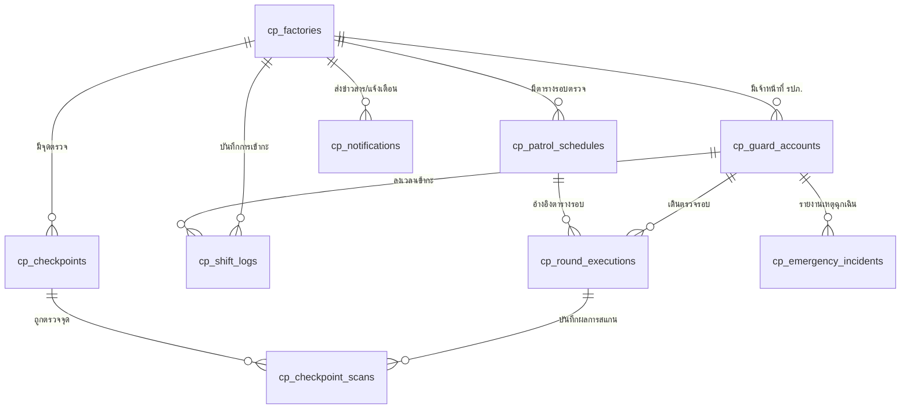

# 🛡️ CHECK POINT MOBILE SYSTEM - DATABASE & ARCHITECTURE SUMMARY
> **เอกสารสรุปโครงสร้างฐานข้อมูล (Database Schema) และสถาปัตยกรรมระบบ Check Point Mobile**

---

## 1. 🏗️ สถาปัตยกรรมระบบโดยรวม (System Architecture)

ระบบ **Check Point Mobile** ออกแบบขึ้นมาเพื่อเป็นแอปพลิเคชันสำหรับเจ้าหน้าที่รักษาความปลอดภัย (รปภ.) ประจำโรงงาน/สาขา เพื่อบันทึกการเข้ากะ เดินตรวจจุดตามรอบ และรายงานเหตุการณ์ผิดปกติ โดยทำงานร่วมกับระบบเว็บแอดมิน (Admin Web Portal) ผ่านฐานข้อมูลกลาง

```mermaid
graph TD
    A[👑 Web Admin / SOC Center] -->|1. กำหนดตารางรอบตรวจ & จุดตรวจ| B[(🗄️ Database: cp_* tables)]
    B -->|2. ซิงค์ตารางรอบ & รายชื่อ รปภ.| C[📱 Check Point Mobile App]
    C -->|3. จับเวลา & แจ้งเตือนล่วงหน้า 5-15 นาที| D[🔔 OS Push Notification]
    C -->|4. รปภ. สแกนจุด + GPS + ถ่ายภาพหลักฐาน| B
    C -->|5. แจ้งเหตุด่วนฉุกเฉิน (SOS / Incident)| A
```

---

## 2. 🗄️ โครงสร้างตารางฐานข้อมูล (10 Core Tables)

ตารางทั้งหมดในระบบใช้ Prefix นำหน้าเป็น **`cp_*`** เพื่อความเป็นระเบียบและไม่ปะปนกับตารางระบบอื่น



---

### 📋 รายละเอียดของแต่ละตารางและฟิลด์ (Table & Field Dictionary)

### 1. `cp_factories` (ตารางข้อมูลโรงงาน / สาขา)
ใช้เก็บข้อมูลสาขาและพิกัดศูนย์กลางของโรงงาน รวมถึงรหัสแอดมินสำหรับลงทะเบียนผูกเครื่องแท็บเล็ต/มือถือประจำป้อม
* `id` (VARCHAR PK): รหัสเฉพาะโรงงาน (เช่น `FAC-ME-001`)
* `code` (VARCHAR UNIQUE): รหัสย่อโรงงาน (เช่น `FAC-ME-01`)
* `name` (VARCHAR): ชื่อเต็มโรงงาน (เช่น `ME Group Enterprise`)
* `address` (TEXT): ที่อยู่โรงงาน
* `province` (VARCHAR): จังหวัด
* `latitude` (DECIMAL): ละติจูดศูนย์กลางโรงงาน (เช่น `14.90330000`)
* `longitude` (DECIMAL): ลองจิจูดศูนย์กลางโรงงาน (เช่น `102.05620000`)
* `radius_meters` (INT): รัศมีพื้นที่ปลอดภัยของโรงงาน (เช่น `200` เมตร)
* `admin_pin` (VARCHAR): รหัส PIN แอดมินสำหรับลงทะเบียนผูกเครื่องครั้งแรก
* `soc_hotline` (VARCHAR): เบอร์โทรสายด่วนศูนย์ควบคุมความปลอดภัย (SOC)
* `supervisor_phone` (VARCHAR): เบอร์โทรหัวหน้าฝ่ายความปลอดภัย

---

### 2. `cp_guard_accounts` (ตารางบัญชีเจ้าหน้าที่ รปภ. ประจำโรงงาน)
ใช้เก็บข้อมูล รปภ. แต่ละท่านที่สังกัดในโรงงานนั้นๆ เพื่อแสดงในหน้ารายชื่อก่อนใส่ PIN เข้ากะ
* `id` (VARCHAR PK): รหัสเฉพาะบัญชี (เช่น `GRD-001`)
* `employee_id` (VARCHAR UNIQUE): รหัสพนักงาน รปภ. (เช่น `00101`)
* `factory_id` (VARCHAR FK): รหัสโรงงานที่สังกัด (เชื่อมกับ `cp_factories.id`)
* `full_name` (VARCHAR): ชื่อ-นามสกุล (เช่น `นายสมศักดิ์ ปลอดภัย`)
* `phone` (VARCHAR): เบอร์โทรศัพท์มือถือ
* `role` (VARCHAR): ตำแหน่งหน้าที่ (เช่น `รปภ. ประจำกะดึก`)
* `assigned_zone` (VARCHAR): โซนพื้นที่รับผิดชอบหลัก
* `avatar_url` (TEXT): ลิงก์รูปภาพโปรไฟล์
* `avatar_emoji` (VARCHAR): อิโมจิแทนตัว (เช่น `👮`)
* `pin_code` (VARCHAR): รหัส PIN 6 หลักสำหรับยืนยันตัวตนเข้าปฏิบัติงาน (เช่น `123456`)
* `is_active` (BOOLEAN): สถานะเปิดใช้งานบัญชี

---

### 3. `cp_shift_logs` (ตารางบันทึกการลงเวลากะ เข้า-ออกงาน)
ใช้บันทึกเวลาที่ รปภ. กด "ลงเวลาเข้ากะ" และ "ลงเวลาออกกะ" พร้อมพิกัด GPS
* `id` (VARCHAR PK): รหัสบันทึกกะ
* `factory_id` (VARCHAR FK): รหัสโรงงาน
* `guard_id` (VARCHAR FK): รหัส รปภ. ผู้ปฏิบัติงาน
* `shift_name` (VARCHAR): ชื่อกะ (เช่น `กะดึก (20:00 - 08:00 น.)`)
* `shift_date` (DATE): วันที่ของกะ (เช่น `2026-08-27`)
* `check_in_time` (TIMESTAMP): วันเวลาที่กดลงเวลาเข้ากะ
* `check_in_latitude` / `check_in_longitude` (DECIMAL): พิกัด GPS ขณะกดเข้ากะ
* `check_out_time` (TIMESTAMP): วันเวลาที่กดลงเวลาออกกะ
* `check_out_latitude` / `check_out_longitude` (DECIMAL): พิกัด GPS ขณะกดออกกะ
* `total_working_minutes` (INT): จำนวนนาทีรวมที่ปฏิบัติงานจริง
* `status` (VARCHAR): สถานะกะ (`pending`, `on_duty`, `completed`, `late`)

---

### 4. `cp_checkpoints` (ตารางมาสเตอร์จุดตรวจที่แอดมินสร้าง)
ใช้เก็บจุดตรวจทั้งหมดในโรงงานที่ รปภ. ต้องเดินไปสแกนตรวจ
* `id` (VARCHAR PK): รหัสจุดตรวจ
* `factory_id` (VARCHAR FK): รหัสโรงงาน
* `point_number` (INT): ลำดับจุดตรวจ (1, 2, 3... 8)
* `name` (VARCHAR): ชื่อจุดตรวจ (เช่น `ป้อมยามหน้าประตูหลัก`, `ลานจัดเก็บสินค้า โซน B`)
* `description` (TEXT): รายละเอียดและสิ่งที่ต้องตรวจเช็ค
* `target_time_desc` (VARCHAR): เวลาเป้าหมายที่ควรตรวจถึง (เช่น `20:15 น.`)
* `latitude` / `longitude` (DECIMAL): พิกัด GPS ที่ถูกต้องของจุดตรวจ
* `allowed_radius_meters` (INT): รัศมีอนุญาตให้สแกน (เช่น `50` เมตร)
* `nfc_tag_uid` (VARCHAR): รหัสชิป NFC ประจำจุด (ถ้ามี)
* `qr_code_data` (VARCHAR): ข้อมูล QR Code ประจำจุด (ถ้ามี)
* `sequence_order` (INT): ลำดับการเดินตรวจ

---

### 5. `cp_patrol_schedules` (ตารางรอบตรวจที่แอดมินกำหนดประจำกะ)
ใช้เก็บตารางรอบตรวจที่แอดมินตั้งไว้ เพื่อให้แอปมือถือนำไปคำนวณและแจ้งเตือนล่วงหน้าอัตโนมัติ
* `id` (VARCHAR PK): รหัสตารางรอบ
* `factory_id` (VARCHAR FK): รหัสโรงงาน
* `round_number` (INT): รอบที่ (1, 2, 3, 4, 5, 6)
* `round_name` (VARCHAR): ชื่อรอบ (เช่น `รอบที่ 1 (20:00 - 22:00 น.)`)
* `start_time` (TIME): เวลาเริ่มรอบ (เช่น `20:00:00`)
* `end_time` (TIME): เวลาสิ้นสุดรอบ (เช่น `22:00:00`)
* `points_count` (INT): จำนวนจุดตรวจในรอบนี้ (เช่น `8` จุด)
* `is_active` (BOOLEAN): เปิดใช้งานรอบนี้หรือไม่

---

### 6. `cp_round_executions` (ตารางบันทึกผลการเดินตรวจรอบจริง)
ใช้บันทึกประวัติการเดินตรวจแต่ละรอบของ รปภ.
* `id` (VARCHAR PK): รหัสบันทึกรอบตรวจ
* `shift_log_id` (VARCHAR FK): เชื่อมโยงกับกะการทำงาน
* `schedule_id` (VARCHAR FK): เชื่อมโยงกับตารางรอบ
* `guard_id` (VARCHAR FK): รปภ. ผู้เดินตรวจ
* `round_number` (INT): รอบที่ตรวจ
* `status` (VARCHAR): สถานะรอบ (`pending`, `in_progress`, `completed`, `late`, `missed`)
* `started_at` / `finished_at` (TIMESTAMP): เวลาเริ่มและสิ้นสุดการเดินตรวจจริง
* `completed_points` / `total_points` (INT): จำนวนจุดที่ตรวจสำเร็จ / ทั้งหมด
* `on_time_points` / `late_points` / `missed_points` (INT): จำนวนจุดที่ตรวจตรงเวลา / ล่าช้า / ขาดตรวจ
* `round_score` (INT): คะแนนประเมินของรอบนั้น (0 - 100)

---

### 7. `cp_checkpoint_scans` (ตารางบันทึกการสแกนตรวจแต่ละจุด)
ใช้เก็บหลักฐานภาพถ่ายและพิกัด GPS ทุกครั้งที่ รปภ. กดถ่ายรูปบันทึกจุดตรวจ
* `id` (VARCHAR PK): รหัสบันทึกการตรวจจุด
* `round_execution_id` (VARCHAR FK): รหัสรอบตรวจ
* `checkpoint_id` (VARCHAR FK): รหัสจุดตรวจ
* `guard_id` (VARCHAR FK): รปภ. ผู้สแกน
* `scanned_at` (TIMESTAMP): เวลาที่สแกนสำเร็จ
* `scan_status` (VARCHAR): สถานะ (`on_time`, `late`, `skipped`)
* `latitude` / `longitude` (DECIMAL): พิกัด GPS จริงขณะถ่ายรูป
* `accuracy_meters` (DECIMAL): ความแม่นยำของสัญญาณ GPS (เมตร)
* `distance_meters` (DECIMAL): ระยะห่างจากจุดตรวจจริง (เมตร)
* `nfc_verified` / `qr_verified` (BOOLEAN): ยืนยันด้วย NFC / QR หรือไม่
* `photos` (JSONB): รายการ URL ภาพถ่ายหลักฐานพร้อมลายน้ำเวลาและพิกัด
* `late_reason` (TEXT): เหตุผลกรณีตรวจล่าช้ากว่าเวลาที่กำหนด
* `remarks` (TEXT): หมายเหตุหรือสิ่งที่พบเห็น

---

### 8. `cp_emergency_incidents` (ตารางแจ้งเหตุฉุกเฉินและขอความช่วยเหลือ)
ใช้บันทึกเหตุการณ์ฉุกเฉิน (ไฟไหม้, ผู้บุกรุก, อุบัติเหตุ) พร้อมส่งต่อไปยังศูนย์ควบคุม (SOC)
* `id` (VARCHAR PK): รหัสแจ้งเหตุ (เช่น `INC-20260826-001`)
* `factory_id` (VARCHAR FK): รหัสโรงงาน
* `reporter_guard_id` (VARCHAR FK): รปภ. ผู้รายงานเหตุ
* `incident_type` (VARCHAR): ประเภทเหตุการณ์ (เช่น `ไฟไหม้ / กลุ่มควัน`)
* `severity_level` (VARCHAR): ระดับความรุนแรง (`low`, `medium`, `high`, `critical`)
* `location_name` (VARCHAR): สถานที่เกิดเหตุ
* `latitude` / `longitude` (DECIMAL): พิกัดจุดเกิดเหตุ
* `details` (TEXT): รายละเอียดเหตุการณ์
* `photos` (JSONB): รูปภาพหลักฐานที่เกิดเหตุ
* `audio_record_url` (TEXT): ไฟล์เสียงบันทึกเหตุการณ์
* `status` (VARCHAR): สถานะ (`reported`, `ack_by_soc`, `investigating`, `resolved`)
* `resolved_at` (TIMESTAMP): เวลาที่เหตุการณ์ยุติ
* `resolved_by` (VARCHAR): ผู้จัดการระงับเหตุ

---

### 9. `cp_notifications` (ตารางการแจ้งเตือน & ประกาศคำสั่งแอดมิน)
ใช้เก็บข้อมูลข่าวสารและคำสั่งด่วนจากแอดมิน รวมถึงประวัติแจ้งเตือนรอบตรวจ
* `id` (VARCHAR PK): รหัสแจ้งเตือน
* `factory_id` (VARCHAR FK): รหัสโรงงาน (ระบุเฉพาะโรงงาน หรือ NULL หากเป็นประกาศรวม)
* `title` (VARCHAR): หัวข้อประกาศ / แจ้งเตือน
* `category` (VARCHAR): หมวดหมู่ (`patrol`, `emergency`, `announcement`)
* `priority` (VARCHAR): ระดับความสำคัญ (`normal`, `urgent`, `critical`)
* `summary` / `content` (TEXT): ข้อความสรุปและเนื้อหาเต็ม
* `banner_image_url` (TEXT): รูปภาพประกอบประกาศ
* `published_by` (VARCHAR): แอดมินหรือหน่วยงานที่ออกประกาศ
* `valid_until` (TIMESTAMP): ประกาศมีผลถึงวันที่
* `target_guard_id` (VARCHAR FK): ส่งให้ รปภ. เจาะจงรายบุคคล (NULL คือทุกคนในโรงงาน)
* `is_read` (BOOLEAN): อ่านแล้วหรือยัง
* `acknowledged_at` (TIMESTAMP): เวลาที่ รปภ. กด "รับทราบคำสั่ง"

---

### 10. `cp_app_settings` (ตารางการตั้งค่าแอปพลิเคชันและอุปกรณ์)
ใช้บันทึกการตั้งค่าของเครื่องมือถือ/แท็บเล็ตประจำป้อม
* `id` (VARCHAR PK): รหัสการตั้งค่า
* `factory_id` (VARCHAR FK): รหัสโรงงาน
* `device_id` (VARCHAR): รหัสเฉพาะของอุปกรณ์ (Device ID)
* `sound_enabled` (BOOLEAN): เปิด/ปิดเสียงแจ้งเตือน
* `sound_volume` (DECIMAL): ระดับความดังเสียง (0.10 - 1.00)
* `selected_sound_id` (VARCHAR): เสียงที่เลือก (เช่น `beep`, `siren`, `chime`)
* `reminder_minutes` (INT): เวลาแจ้งเตือนล่วงหน้า (0, 5, 10, 15 นาที)
* `vibration_enabled` (BOOLEAN): เปิด/ปิดระบบสั่น
* `watermark_enabled` (BOOLEAN): ประทับลายน้ำพิกัด & เวลาบนรูปถ่าย
* `auto_flash_night` (BOOLEAN): เปิดไฟแฟลชช่วยตรวจกะดึกอัตโนมัติ

---

## 3. 🔔 กลไกการแจ้งเตือนรอบตรวจแบบเรียลไทม์ (Real-Time Push Notification Engine)

1. **การคำนวณเวลาอัตโนมัติ**:
   * แอปจะอ่านเวลาเริ่มของแต่ละรอบตรวจจาก `cp_patrol_schedules`
   * นำมาคำนวณล่วงหน้าตามค่า `reminder_minutes` ที่ตั้งไว้ (เช่น รอบเริ่ม 22:00 น. ➔ แจ้งเตือนเวลา 21:55 น.)
2. **การเด้งเตือนในแอป (GlobalPushBanner)**:
   * เมื่อถึงเวลา หรือมีประกาศด่วน แถบแจ้งเตือนจะสไลด์ลงมาจากขอบบนของหน้าจอทันที พร้อมเสียงและระบบสั่น
3. **การเด้งเตือนนอกแอป (OS System Notifications)**:
   * ใช้ `expo-notifications` ส่งสัญญาณเข้าสู่ระบบปฏิบัติการของโทรศัพท์ (Android / iOS)
   * แม้ปิดหน้าจอ ล็อกเครื่อง หรือพับแอปไปหน้าโฮม โทรศัพท์จะสั่นและส่งเสียงพร้อมเด้งข้อความบนหน้าจอล็อก (Lock Screen)

---

## 4. 📂 ตำแหน่งไฟล์ที่เกี่ยวข้องในโปรเจกต์

| ประเภทไฟล์ | ที่ตั้งไฟล์ (Path) |
|---|---|
| 📄 **SQL Schema DDL** | [`database/checkpoint_schema.sql`](file:///c:/Users/Tanapon/Downloads/check-poit-mobile/check%20point/database/checkpoint_schema.sql) |
| 📄 **Prisma ORM Schema** | [`database/schema.prisma`](file:///c:/Users/Tanapon/Downloads/check-poit-mobile/check%20point/database/schema.prisma) |
| 📄 **TypeScript Database Types** | [`types/checkpointDatabase.ts`](file:///c:/Users/Tanapon/Downloads/check-poit-mobile/check%20point/types/checkpointDatabase.ts) |
| 📱 **In-App Push Banner Component** | [`components/GlobalPushBanner.tsx`](file:///c:/Users/Tanapon/Downloads/check-poit-mobile/check%20point/components/GlobalPushBanner.tsx) |
| ⚙️ **Patrol Reminder Engine** | [`lib/patrolReminderEngine.ts`](file:///c:/Users/Tanapon/Downloads/check-poit-mobile/check%20point/lib/patrolReminderEngine.ts) |
| 📲 **OS System Notification Helper** | [`lib/systemNotificationHelper.ts`](file:///c:/Users/Tanapon/Downloads/check-poit-mobile/check%20point/lib/systemNotificationHelper.ts) |
