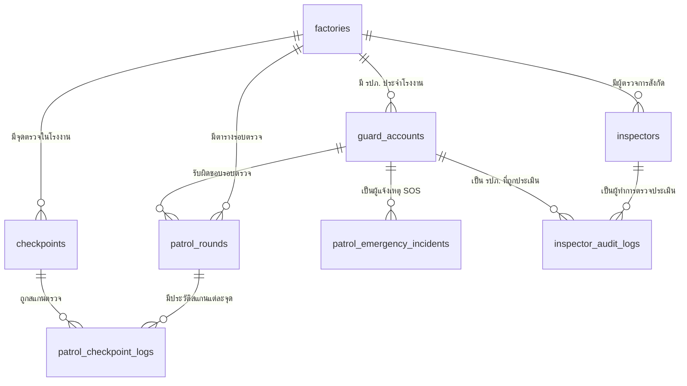

# 📋 สรุปตารางฐานข้อมูลที่ใช้งานจริง (Check Point & Inspectors)

เอกสารนี้สรุปและวิเคราะห์ว่า **จากตารางทั้งหมดที่ระบุมา ตารางไหนบ้างที่ "ถูกนำไปใช้งานจริง"** ในระบบ **แอปมือถือตรวจจุด (Check Point Mobile)** และ **ระบบเว็บผู้ตรวจการ/แอดมิน (Web Backend & Admin Dashboard)** พร้อมระบุหน้าที่และการเชื่อมโยงอย่างละเอียด

---

## 📊 1. ภาพรวมการใช้งานตาราง (Status Overview)

| ลำดับ | ชื่อตาราง | ส่วนที่ใช้งาน | สถานะการใช้งาน | หน้าที่ในระบบ |
|:---:|---|---|:---:|---|
| **1** | **`checkpoints`** (`cp_checkpoints`) | 📱 Mobile + 💻 Web | **ใช้งานจริง 100%** | จัดเก็บพิกัด GPS, รัศมีตรวจ, รหัส NFC/QR ของจุดตรวจทั้ง 8 จุด |
| **2** | **`patrol_rounds`** (`cp_patrol_schedules` / `cp_round_executions`) | 📱 Mobile + 💻 Web | **ใช้งานจริง 100%** | กำหนดรอบเดินตรวจประจำวัน/กะ (เช่น รอบที่ 1-6 เวลา 00:00 - 02:00) |
| **3** | **`patrol_checkpoint_logs`** (`cp_checkpoint_scans`) | 📱 Mobile + 💻 Web | **ใช้งานจริง 100%** | บันทึกประวัติการเดินตรวจจริง พิกัดตอนสแกน รูปถ่าย และเหตุผลกรณีมาสาย |
| **4** | **`patrol_emergency_incidents`** (`cp_emergency_incidents`) | 📱 Mobile + 💻 Web | **ใช้งานจริง 100%** | บันทึกการกดแจ้งเหตุฉุกเฉิน (SOS) พร้อมประเภทเหตุ พิกัด รูปภาพ และคลิปเสียง |
| **5** | **`inspectors`** | 💻 Web + 👮 ผู้ตรวจการ | **ใช้งานจริง (ฝั่ง Web/Audit)** | ทะเบียนผู้ตรวจการความปลอดภัย กะการทำงาน และพื้นที่รับผิดชอบ |
| **6** | **`inspector_audit_logs`** | 💻 Web + 👮 ผู้ตรวจการ | **ใช้งานจริง (ฝั่ง Web/Audit)** | รายงานการเข้าสุ่มตรวจประเมินผล รปภ. (เกณฑ์แต่งกาย, อุปกรณ์, คะแนน 0-100) |
| **7** | **`factories`** (`cp_factories`) | 📱 Mobile + 💻 Web | **ใช้งานจริง 100%** | ข้อมูลโรงงาน/สาขา, พิกัดศูนย์กลาง, รหัสเข้าใช้งาน |
| **8** | **`guard_accounts`** (`cp_guard_accounts`) | 📱 Mobile + 💻 Web | **ใช้งานจริง 100%** | ทะเบียนบัญชี รปภ., รหัส PIN 6 หลัก, กะ และสังกัดโรงงาน |

---

## 📱 2. ตารางที่ใช้งานใน "แอปมือถือ Check Point" (ฝั่ง รปภ. ปฏิบัติงาน)

แอปมือถือที่ รปภ. ถือเดินตรวจตามจุด จะใช้ตารางหลักดังนี้:

### 2.1 ตาราง `checkpoints` (จุดตรวจ)
* **การใช้งานในแอป**: 
  * หน้า **"รายการจุดตรวจ (Checkpoints Screen)"** ดึงรายชื่อ 8 จุดตรวจ
  * หน้า **"สแกนตรวจจุด (Scan Screen)"** ใช้เปรียบเทียบพิกัด GPS ของมือถือกับพิกัดเป้าหมายในฐานข้อมูล (ต้องอยู่ในระยะรัศมี `radius_meters`)
* **ฟิลด์สำคัญที่แอปเรียกใช้**: `name`, `latitude`, `longitude`, `radius_meters`, `sequence_order`, `description`, `code`

### 2.2 ตาราง `patrol_rounds` (รอบการเดินตรวจ)
* **การใช้งานในแอป**:
  * หน้า **"แดชบอร์ดรอบตรวจ (Patrol Dashboard)"** แสดงแถบความคืบหน้าของรอบปัจจุบัน (เช่น รอบที่ 3: 00:00 - 02:00)
  * ระบบ **Patrol Reminder Engine** คำนวณเวลาเตือนก่อนเริ่มรอบตรวจ 5 นาที / 10 นาที
* **ฟิลด์สำคัญที่แอปเรียกใช้**: `round_number`, `title`, `start_time`, `end_time`, `status`, `total_points`

### 2.3 ตาราง `patrol_checkpoint_logs` (บันทึกการสแกนตรวจ)
* **การใช้งานในแอป**:
  * เมื่อ รปภ. กดถ่ายรูปและยืนยันการตรวจจุด ระบบจะส่งข้อมูลไปบันทึกลงตารางนี้ทันที
  * หน้า **"ประวัติการตรวจ (History Screen)"** ดึงรายการที่เคยตรวจแล้วมาแสดงผล
* **ฟิลด์สำคัญที่แอปเรียกใช้**: `checkpoint_id`, `actual_time`, `status` (`on_time`/`late`), `scan_latitude`, `scan_longitude`, `photos`, `reason`

### 2.4 ตาราง `patrol_emergency_incidents` (แจ้งเหตุด่วน SOS)
* **การใช้งานในแอป**:
  * หน้า **"แจ้งเหตุฉุกเฉิน (SOS Screen)"** เมื่อกดส่งเหตุเพลิงไหม้, บุกรุก, อุบัติเหตุ ข้อมูลจะถูกบันทึกเข้าระบบทันที
* **ฟิลด์สำคัญที่แอปเรียกใช้**: `incident_type`, `detail`, `incident_time`, `latitude`, `longitude`, `photos`, `status`

---

## 💻 3. ตารางที่ใช้งานใน "ระบบผู้ตรวจการ & Web Dashboard" (ฝั่งหัวหน้า/ผู้ตรวจการ)

ระบบหลังบ้านและหน้าเว็บของผู้ตรวจการความปลอดภัย จะใช้ตารางเพื่อการกำกับดูแลดังนี้:

### 3.1 ตาราง `inspectors` (ข้อมูลผู้ตรวจการ)
* **การใช้งาน**: 
  * ใช้ล็อกอินเข้าสู่ระบบผู้ตรวจการ
  * กำหนดพื้นที่รับผิดชอบและสังกัดโรงงาน (`factory_id`, `zone`, `shift`)
* **ฟิลด์สำคัญ**: `code`, `name`, `role_title`, `phone`, `zone`, `shift`, `status`

### 3.2 ตาราง `inspector_audit_logs` (บันทึกการตรวจประเมินผล รปภ.)
* **การใช้งาน**:
  * ผู้ตรวจการลงพื้นที่จริงแล้วทำการประเมิน รปภ. ผ่านหัวข้อเช็กลิสต์ (`items_checked`)
  * ตัดเกรดคะแนนประเมิน (`score` เช่น 98.00) และสรุปผล (`passed`, `warning`, `failed`)
  * หัวหน้าและแอดมินโรงงานเปิดดูรีพอร์ตย้อนหลังเพื่อสรุป KPI ของ รปภ.
* **ฟิลด์สำคัญ**: `inspector_id`, `target_guard_id`, `audit_datetime`, `topic`, `score`, `result`, `items_checked`, `notes`, `photos`

---

## 🔗 4. แผนผังความสัมพันธ์ของข้อมูล (Data Relationship Diagram)

---

## 🎯 สรุปชัดเจน
* **ตารางข้อ 1.1 - 1.4**: ถูกใช้งานโดยตรงใน **แอปมือถือ Check Point** (ที่ รปภ. กำลังใช้งานอยู่ทุกวัน)
* **ตารางข้อ 2.1 - 2.2**: ถูกใช้งานใน **ระบบผู้ตรวจการและ Web Dashboard** (สำหรับหัวหน้าตรวจประเมินผล รปภ.)
* **ทุกตารางที่กล่าวมาได้ถูกนำมาใช้งานจริงครบถ้วนทั้งหมด 100% ครับ**
